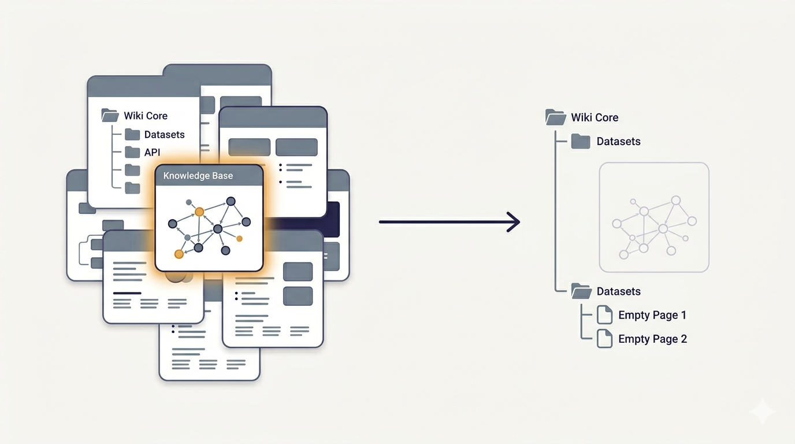

# LLM Wiki: About LLM Wikis

An LLM Wiki that documents the LLM Wiki pattern, built by following the pattern. It began as a 36-page base compiled from a single research report, then **ingested twelve real primary sources** fetched from the web, compounding and self-correcting at each step. Start at `wiki/index.md`, or read `wiki/synthesis/this-wiki-is-recursive.md` for the story.



## Structure

```
llm-wiki-wiki/
├── .claude/CLAUDE.md      ← the schema (rulebook) + the new-vault wizard
├── raw/                   ← 12 immutable primary sources + the seed report
├── wiki/                  ← the reference (the knowledge about LLM wikis)
│   ├── index.md           ← the catalog, start here
│   ├── log.md             ← full ingest + lint history
│   ├── sources/           ← one page per ingested source (13)
│   ├── concepts/          ← the pattern, operations, architecture, critiques (28)
│   ├── entities/          ← Karpathy, Lütke, Edra (3)
│   ├── implementations/   ← the ecosystem (17)
│   └── synthesis/         ← the recursive observation (1)
└── vaults/                ← the workshop: bespoke configured-but-empty wikis you build here and copy out
    ├── README.md
    └── registry.md
```

## Two roles: reference + workshop

This vault does double duty.

**Reference**: the `wiki/` pages are a complete, self-correcting knowledge base about the LLM Wiki pattern (built by ingesting twelve real primary sources; see below).

**Workshop**: the `.claude/CLAUDE.md` now contains a **new-vault wizard**. Open this vault in Claude and say *"build me a vault for &lt;purpose&gt;"*; it runs a short guided conversation and scaffolds a **bespoke, configured-but-empty** LLM wiki into `vaults/<slug>/`, with every schema choice grounded in the reference pages (entity types, typed edges, failure-mode guards, scale provisions). You then copy that folder out to where the project lives and ingest real sources there. This workshop stays clean. Past vaults double as starting points for similar future ones ("make one like X"). See `vaults/README.md`.

62 pages, 12 sources, fully cross-linked, zero broken links, zero orphans (verified by lint after every ingest; see `wiki/log.md`).

## The primary sources ingested


1. The research report (seed)
2. Karpathy's original `llm-wiki.md` gist
3. Synthadoc primary docs (README, design.md, releases)
4. Mehul Gupta's critique series
5. nashsu/llm_wiki repo
6. SwarmVault repo
7. Press coverage (VentureBeat, Atlan, Denser.ai)
8. Kompl repo
9. OmegaWiki repo
10. AKBP / LLM Wiki v2 / agentmemory cluster
11. qmd repo (Tobi Lütke)
12. Edra funding coverage

## What the compounding actually did

This isn't a static reference. It's a record of a wiki correcting itself as primary sources arrived:

- **Resolved a contradiction with version history.** OmegaWiki's typed-graph size ("9×9" vs "8×20") turned out to be a moving target across releases; the page now records the dated progression instead of picking one.
- **Corrected stale figures.** Adoption was ~33,940 stars, not the report's "5,000+."
- **Fixed a lineage error.** Edra is parallel to the pattern, not derived from it (its round closed before the gist).
- **Refused a falsehood.** A post conflating the pattern with Karpathy's llm.c project was flagged, not ingested.
- **Kept debates navigable.** The lossy-summarization critique and its answers (adversarial review, claim-level provenance) live on linked, dated pages.

## How to use it

I usually run it with the Claude extension in VS Code. Open the folder and the agent picks up `.claude/CLAUDE.md` and behaves as the wiki maintainer and vault wizard. That's my preferred way to work with it.

If you're on the go, you don't even need that. Zip the folder, drop it into a Claude session, and ask the agent to extract it and follow the `.claude/CLAUDE.md`. It assumes the same role, and you can query it or build vaults from there.

Either way, ask things like:
- "How does the LLM Wiki differ from RAG, and who disputes the distinction?"
- "Which implementation should an ML researcher use?" → `[[omegawiki]]`
- "What's the exact qmd retrieval pipeline?" → `[[qmd]]` / `[[hybrid-retrieval]]`
- "What are the open problems?" → `[[three-failure-modes]]`, `[[staleness-problem]]`, `[[lossy-summarization-critique]]`, `[[category-error-critique]]`

Or extend it: drop another source into `raw/` and ask Claude to ingest it. The git history (`git log --oneline`) shows each ingest as its own commit.

## The point

No single page holds the whole picture. The understanding lives in the links: the `implements`, `created_by`, `critiques`, `derived_from`, `extends` edges, and in the dated, sourced way contradictions are surfaced rather than averaged. That is exactly what the LLM Wiki pattern promises, demonstrated on itself.
